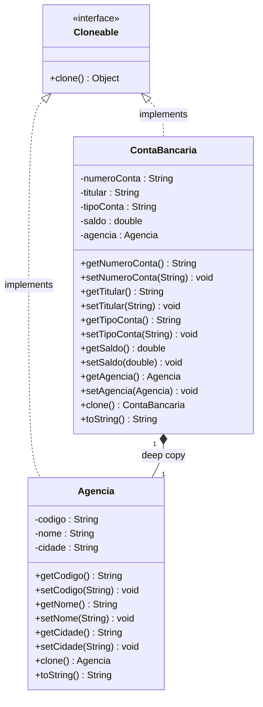

# Banco Prototype — Padrão de Projeto Prototype

> Projeto Java com Maven demonstrando o **Padrão de Projeto Prototype** aplicado a um sistema bancário simples, desenvolvido para a disciplina de Arquitetura e Padrões de Projeto.

---

## Sumário

- [Sobre o Padrão Prototype](#sobre-o-padrão-prototype)
- [Estrutura do Projeto](#estrutura-do-projeto)
- [Diagrama de Classes](#diagrama-de-classes)
- [Classes](#classes)
- [Deep Copy vs Shallow Copy](#deep-copy-vs-shallow-copy)
- [Testes JUnit](#testes-junit)
- [Como Executar](#como-executar)
- [Dependências](#dependências)

---

## Sobre o Padrão Prototype

O padrão **Prototype** é um padrão de projeto criacional que permite criar novos objetos copiando (clonando) um objeto existente, sem depender de suas classes concretas. É útil quando:

- A criação de um objeto do zero é custosa ou complexa
- Você precisa criar várias instâncias com estado inicial semelhante
- O código não deve depender da classe concreta do objeto a ser copiado

Em Java, o padrão é implementado através da interface `Cloneable` e da sobrescrita do método `clone()`.

---

## Estrutura do Projeto

```
banco-prototype/
├── pom.xml
├── README.md
└── src/
    ├── main/
    │   └── java/banco/prototype/
    │       ├── Agencia.java
    │       └── ContaBancaria.java
    └── test/
        └── java/banco/prototype/
            └── ContaBancariaTest.java
```

---

## Diagrama de Classes



**Legenda:**
- `<<interface>>` — marca `Cloneable` como interface Java
- `<|..` — realização/implementação (linha tracejada com seta vazia)
- `*--` — composição com multiplicidade 1..1, rotulada como `deep copy`
- `-` prefixo — atributo privado; `+` prefixo — método público

---

## Classes

### `ContaBancaria`

Classe principal e **protótipo** do padrão. Representa uma conta bancária com os atributos:

| Atributo | Tipo | Descrição |
|---|---|---|
| `numeroConta` | `String` | Número identificador da conta |
| `titular` | `String` | Nome do titular da conta |
| `tipoConta` | `String` | Tipo: `CORRENTE`, `POUPANCA` ou `INVESTIMENTO` |
| `saldo` | `double` | Saldo atual da conta |
| `agencia` | `Agencia` | Agência à qual a conta pertence |

O método `clone()` realiza **deep copy**, clonando também o objeto `Agencia` aninhado:

```java
@Override
public ContaBancaria clone() throws CloneNotSupportedException {
    ContaBancaria contaClone = (ContaBancaria) super.clone();
    contaClone.agencia = (Agencia) this.agencia.clone(); // deep copy!
    return contaClone;
}
```

---

### `Agencia`

Classe auxiliar que representa a agência bancária. Também implementa `Cloneable` para permitir ser clonada individualmente dentro do processo de deep copy de `ContaBancaria`.

| Atributo | Tipo | Descrição |
|---|---|---|
| `codigo` | `String` | Código identificador da agência |
| `nome` | `String` | Nome da agência |
| `cidade` | `String` | Cidade onde a agência está localizada |

---

## Deep Copy vs Shallow Copy

| Conceito | O que acontece | Problema |
|---|---|---|
| **Shallow copy** (`super.clone()`) | Copia os valores primitivos e as **referências** dos objetos aninhados | Clone e original compartilham a mesma `Agencia` — alterar uma afeta a outra |
| **Deep copy** (implementação manual) | Além da shallow copy, clona **também** os objetos aninhados | Clone e original são completamente independentes |

```
Original                    Clone (deep copy)
┌──────────────────┐        ┌──────────────────┐
│  ContaBancaria   │        │  ContaBancaria   │
│  titular: Carlos │        │  titular: Ana    │
│  agencia ──────────────╳  │  agencia ────────────┐
└──────────────────┘   ╳   └──────────────────┘   │
                        ╳                           ▼
         ┌──────────────┐                ┌──────────────┐
         │   Agencia    │                │   Agencia    │
         │  cod: 0001   │                │  cod: 0001   │
         └──────────────┘                └──────────────┘
             (original)                     (cópia independente)
```

---

## Testes JUnit

Os testes utilizam **JUnit 5** com `assertEquals` e `assertNotSame` para validar o comportamento do padrão.

| Teste | Cenário | O que valida |
|---|---|---|
| `testCloneIndependencia` | Altera `titular`, `saldo` e `numeroConta` no clone | Original permanece inalterado |
| `testDeepCopyAgencia` | Altera `codigo`, `nome` e `cidade` da agência do clone | Agência do original não é afetada |
| `testCloneAlteraTipoConta` | Clone muda de `POUPANCA` para `INVESTIMENTO` | Tipos de conta são independentes |
| `testCloneReferenciasDiferentes` | Compara referências de memória | Objetos distintos na heap (`assertNotSame`) |

Exemplo de teste:

```java
@Test
void testDeepCopyAgencia() throws CloneNotSupportedException {
    Agencia agencia = new Agencia("0002", "Agência Norte", "Belo Horizonte");
    ContaBancaria original = new ContaBancaria("55555-5", "Pedro Lima",
            "POUPANCA", 3000.00, agencia);

    ContaBancaria clone = original.clone();
    clone.getAgencia().setCodigo("0099");
    clone.getAgencia().setCidade("São Paulo");

    // Agência do original NÃO foi alterada
    assertEquals("...Agencia{codigo='0002'...", original.toString());
    // Agência do clone reflete as mudanças
    assertEquals("...Agencia{codigo='0099'...", clone.toString());
}
```

---

## Como Executar

### Pré-requisitos

- Java 11 ou superior
- Maven 3.6 ou superior

### Compilar e executar os testes

```bash
mvn test
```

### Apenas compilar

```bash
mvn compile
```

### Resultado esperado dos testes

```
[INFO] Tests run: 4, Failures: 0, Errors: 0, Skipped: 0
[INFO] BUILD SUCCESS
```

---

## Dependências

```xml
<dependency>
    <groupId>org.junit.jupiter</groupId>
    <artifactId>junit-jupiter</artifactId>
    <version>5.9.3</version>
    <scope>test</scope>
</dependency>
```

---

## Referências

- [Refactoring Guru — Prototype Pattern](https://refactoring.guru/design-patterns/prototype)
- [Java SE — Interface Cloneable](https://docs.oracle.com/en/java/docs/api/java.base/java/lang/Cloneable.html)
- GOF — *Design Patterns: Elements of Reusable Object-Oriented Software*, Gamma et al.
